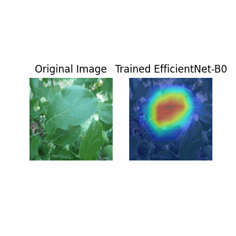
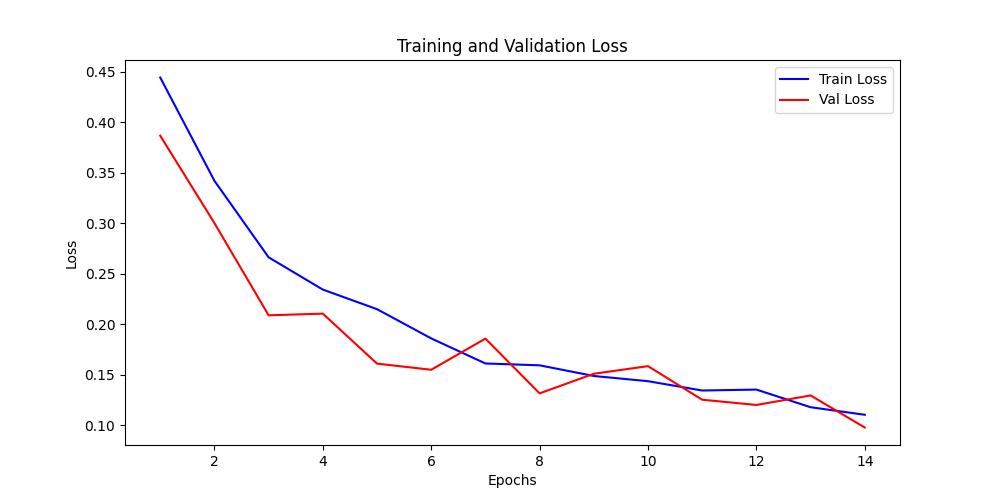
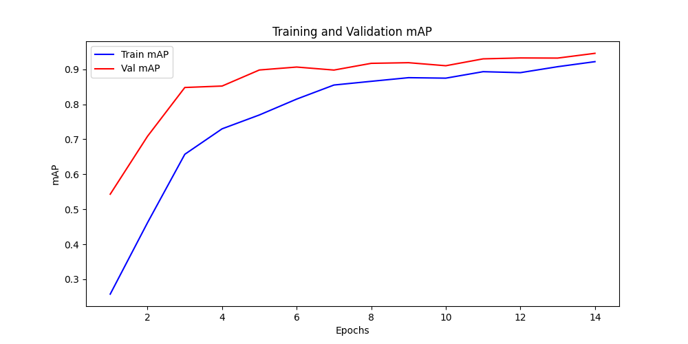

# Visual-Efficientnets

## 数据集介绍

### 数据集概况

本项目使用的Plant Pathology-2021包含**12个类别**，每个类别对应不同的叶片病害类型。然而，不同类别之间存在标签重复（例如，`scab`在多个类别中出现），这增加了模型训练的复杂性。因此，我们对数据集进行了类别合并，将原有的12个类别转换为**6个类别**，并将其视为一个**多标签分类**问题。

### 类别说明

经过合并后的6个类别如下：

- scab
- healthy
- frog_eye_leaf_spot
- rust
- complex
- powdery_mildew

每个类别通过**One-Hot编码**进行标签表示，以适应多标签分类任务。

---

## 数据处理

### One-Hot编码操作

**One-Hot编码**是一种将分类数据转换为二进制向量的技术。在多标签分类任务中，每个样本可以同时属于多个类别。**One-Hot**编码能够有效地表示这种多标签关系，使得模型能够处理每个类别的独立预测。

在本项目中，由于原始数据集包含12个类别，且存在标签重复（如scab在多个类别中出现），我们将类别合并为6个类别，并将其转换为多标签分类问题。具体操作如下：

1. **读取原始标签文件**：使用 **pandas** 读取包含图像名称及其对应标签的 CSV 文件。
2. **标签拆分**：将标签字符串拆分为标签列表
3. **One-Hot编码**：使用 MultiLabelBinarizer 将标签列表转换为 One-Hot编码向量。
4. **合并数据**：将图像名称与编码后的标签向量合并，生成最终的标签文件。

具体的代码实现可以参考项目中`label.py`文件，处理后生成三个csv文件，存放于data文件夹中

### 数据增强策略

在深度学习中，数据增强（Data Augmentation）是一种通过对训练数据进行随机变换来生成更多样本的方法。这不仅能够增加数据的多样性，减少过拟合，还能帮助模型更好地泛化到未见过的数据。在本项目中，由于叶片病害分类属于**细粒度分类**，类内差异大、类间差异小，数据增强显得尤为重要。

在本项目的`train.py`中，我们对训练数据应用了多种数据增强技术，具体如下：

```python

train_transform = transforms.Compose([
    transforms.Resize((224, 224)),
    transforms.RandomHorizontalFlip(),
    transforms.RandomRotation(15),
    transforms.ToTensor(),
    transforms.Normalize(mean=[0.485, 0.456, 0.406],
                         std=[0.229, 0.224, 0.225]),
])

```

**具体方法介绍**

1. Resize： 将所有图像调整为统一的尺寸（224x224），确保模型输入的一致性。

2. RandomHorizontalFlip： 随机水平翻转图像。此方法可以模拟植物叶片在不同方向上的自然生长情况，增加模型对方向变化的鲁棒性。

3. RandomRotation： 随机旋转图像最多15度。旋转变换能够使模型更好地识别不同角度下的叶片病害特征，提升模型的泛化能力。

4. ToTensor： 将PIL图像或NumPy ndarray 转换为形状为 (C, H, W) 的张量，并且将像素值归一化到 [0, 1] 之间。

5. Normalize： 使用 ImageNet 的均值和标准差对图像进行归一化处理，有助于加快训练收敛速度，提高模型性能。

数据增强在本项目中的意义可以总结为以下三点：

1. **提高模型的泛化能力**
通过对训练数据进行随机变换，模型能够学习到更加多样化的特征，减少对特定图像特征的依赖，从而在测试集上表现出更好的泛化能力。

2. **缓解过拟合**
数据增强通过增加训练样本的多样性，有效缓解模型在训练集上的过拟合问题，使模型在未见过的数据上表现更稳健。

3. **强化对细粒度特征的学习**
在细粒度分类任务中，类内差异大、类间差异小，数据增强能够帮助模型更好地捕捉细微的图像特征差异，提高分类的准确性。

---

## 项目结构

### 目录

`data`
文件夹中需要自己导入图片数据，有处理好的`processed_train_labels.csv`等标签文件

`checkpoints`

存放了训练好的模型权重，需要时可以自行导入

`outputs`

主要存放可视化的结果

`submmisions`

存放`submit`操作生成的`test`的csv文件

### 代码结构

项目代码位于 `src/` 目录下，主要包括以下脚本：

`dataset.py`

负责数据集的加载和预处理。定义了 `PlantPathologyDataset` 类，用于读取图像及其对应的标签，并应用必要的图像变换。

`model.py`

定义了模型结构。通过 get_model 函数加载预训练的 EfficientNet 模型，并根据任务需求修改最后的全连接层以适应6个类别的多标签分类。

`train.py`

包含训练和验证的循环逻辑。利用 GPU 进行加速训练，使用混合精度训练技术提高效率，并实现早停机制防止过拟合。后续会详细介绍。

`evaluate.py`

用于在验证集上评估训练好的模型性能。计算损失、F1 分数和准确率等指标，并且在验证集上动态更新模型的`threshold`，在得到最优的`threshold`后在训练集上进行测试，并且生成相应的曲线

`generate_submission.py`

使用训练好的模型对测试集进行预测，并生成符合提交要求的 CSV 文件。确保测试集图像路径和标签文件路径正确配置。

`visualize.py`

应用GradCam，将EfficientNet的运行过程可视化，生成训练过程的热力图

`utils.py`

提供辅助功能，包括：

- calculate_metrics：计算 F1 分数和准确率。
- save_checkpoint：保存模型检查点。
- load_checkpoint：加载模型检查点。
- tensor2img：将张量转换为图像格式。
- 其他可视化辅助函数。

`main.py`

项目的主入口脚本。通过命令行参数选择不同的操作模式（训练、评估、生成提交文件），实现流程的统一管理。

## **评估指标说明**

在此先说明我们的评估指标

### 1. **Precision（精确率，P）**

**定义**：
精确率表示模型预测为正类的样本中，实际为正类的比例。换句话说，它衡量的是模型预测的准确性。

**公式**：

$$
\text{Precision} = \frac{TP}{TP + FP} 
$$

- **TP（True Positive）**：真正例，模型正确预测为正类的样本数。
- **FP（False Positive）**：假正例，模型错误预测为正类的样本数。

**意义**：
高精确率意味着模型在预测为正类时，错误的概率较低，即模型的假正例较少。

---

### 2. **Recall（召回率，R）**

**定义**：
召回率表示实际为正类的样本中，模型正确预测为正类的比例。它衡量的是模型的覆盖能力。

**公式**：

$$
 \text{Recall} = \frac{TP}{TP + FN} 
$$

- **FN（False Negative）**：假负例，模型错误预测为负类的样本数。

**意义**：
高召回率意味着模型能够识别出大部分的正类样本，假负例较少。

---

### 3. **F1 Score（F1 分数，F1）**

**定义**：
F1 分数是精确率和召回率的调和平均值，综合考虑了两者的平衡。它是一个权衡精确率和召回率的指标。

**公式**：

$$
 \text{F1} = 2 \times \frac{\text{Precision} \times \text{Recall}}{\text{Precision} + \text{Recall}} 
$$

**意义**：
F1 分数在精确率和召回率之间寻找平衡，特别适用于类别不平衡的情况。

---

### 4. **Average Precision（平均精度，AP）**

**定义**：
平均精度是基于精确率-召回率曲线（Precision-Recall Curve）下的面积。它衡量的是模型在不同阈值下的整体性能。

**公式**：

$$
 \text{AP} = \int_{0}^{1} P(r) \, dr 
$$

**意义**：
AP 提供了模型在所有可能的阈值下的性能概述，较高的 AP 表明模型在整体上表现良好。

---

### **宏平均（macro-all）和微平均（micro-all）说明**

在多类别或多标签分类任务中，宏平均和微平均是两种常用的聚合方法，用于计算整体的评估指标。

#### 1. **宏平均（Macro Average）**

**定义**：
宏平均是对每个类别的评估指标（如 Precision、Recall、F1、AP）分别计算后，再取这些指标的简单平均值。每个类别在计算时被赋予相同的权重。

**计算方法**：

- 对于每个类别，计算 Precision、Recall、F1 和 AP。
- 将所有类别的 Precision、Recall、F1 和 AP 分别取平均。

**公式**：

$$
 \text{Macro Average} = \frac{1}{N} \sum_{i=1}^{N} \text{Metric}_i 
$$

其中， N  是类别的总数， $\text{Metric}_i$  是第 $ i $ 个类别的某一指标。

**意义**：
宏平均强调各类别的独立表现，适用于类别数量较少且每个类别同等重要的情况。然而，对于类别不平衡的数据集，宏平均可能会被少数类别的表现所主导。

---

#### 2. **微平均（Micro Average）**

**定义**：
微平均是将所有类别的 True Positives（TP）、False Positives（FP）和 False Negatives（FN）累加后，再计算总体的评估指标。各类别在计算时的权重与其样本数成正比。

**计算方法**：
- 将所有类别的 TP、FP 和 FN 累加。
- 使用累加后的 TP、FP 和 FN 计算 Precision、Recall 和 F1。

**公式**：
$$ \text{Micro Average Precision} = \frac{\sum_{i=1}^{N} TP_i}{\sum_{i=1}^{N} (TP_i + FP_i)} $$
$$ \text{Micro Average Recall} = \frac{\sum_{i=1}^{N} TP_i}{\sum_{i=1}^{N} (TP_i + FN_i)} $$
$$ \text{Micro Average F1} = \frac{2 \times \text{Micro Precision} \times \text{Micro Recall}}{\text{Micro Precision} + \text{Micro Recall}} $$

**意义**：
微平均考虑了各类别的样本数量，对于类别不平衡的数据集，微平均更能反映整体性能。然而，它可能会掩盖少数类别的表现。

## 训练机制详解

### 概述

`train.py` 是本项目中负责模型训练和验证的核心脚本。它实现了从数据加载、模型初始化、训练过程管理，到模型评估和保存的完整流程。以下将详细介绍训练机制的各个关键环节及其背后的逻辑。

### 模型初始化

项目选择了 **EfficientNet-B0** 作为基础模型，因其在参数效率和性能上表现优异，适合处理细粒度分类任务。通过预训练模型的加载，能够利用在大规模数据集上学到的丰富特征，提升模型的泛化能力。

- **预训练模型**：使用在 ImageNet 上预训练的 EfficientNet-B0，可以加快训练收敛速度并提高初始性能。
- **修改输出层**：根据多标签分类的需求，将模型的最后一层全连接层调整为适应**6个类别**。这种调整确保模型输出与任务需求相匹配。

### 数据预处理与增强

为了提升模型的泛化能力和防止过拟合，训练数据进行了多种增强处理。这些增强策略包括随机水平翻转和随机旋转等，通过增加数据的多样性，使模型能够学习到更具鲁棒性的特征。

- **统一尺寸**：所有图像被调整为统一的尺寸（224x224），确保模型输入的一致性。
- **随机水平翻转**：模拟叶片在不同方向上的自然生长情况，增加模型对方向变化的适应能力。
- **随机旋转**：通过随机旋转图像，增强模型对不同角度的叶片病害特征的识别能力。
- **归一化**：使用 ImageNet 的均值和标准差对图像进行归一化处理，有助于加快训练收敛速度，提高模型性能。

### 数据加载

数据通过自定义的 `PlantPathologyDataset` 类进行加载，并使用 `DataLoader` 进行批量处理。`DataLoader` 提供了高效的数据读取和批处理机制，支持多线程加载，加快训练过程。

- **批次大小**：设置为 32，平衡了训练速度和内存消耗，充分利用 GPU 资源。
- **数据打乱**：训练集数据在每个 epoch 前进行打乱，确保模型见到的数据分布更加随机，有助于提升泛化能力。
- **多线程加载**：使用多个工作线程（如 4 个）加快数据加载速度，减少训练过程中的数据等待时间。

### 损失函数与优化器

本项目采用了 **BCEWithLogitsLoss** 作为损失函数，适用于多标签二分类任务。优化器选择了 **Adam**，因其在处理大规模数据和参数时表现出色，能够快速收敛。

- **损失函数**：`BCEWithLogitsLoss` 结合了 Sigmoid 激活和二元交叉熵损失，适合多标签分类任务。
- **优化器**：Adam 优化器凭借自适应学习率调整能力，能够在复杂的损失曲面上表现优异。
- **学习率调度器**：使用 `ReduceLROnPlateau`，根据验证集的损失动态调整学习率，帮助模型在训练过程中更好地收敛。

### 混合精度训练

为了加快训练速度并减少显存占用，项目引入了 **混合精度训练**。通过 `torch.cuda.amp` 中的 `autocast` 和 `GradScaler`，实现了半精度浮点数计算，提升了训练效率，同时保持了模型的精度。

- **自动混合精度**：`autocast` 自动选择适当的精度进行计算，减少内存使用和加速计算。
- **梯度缩放**：`GradScaler` 动态调整梯度值，防止在半精度训练中出现梯度下溢问题，确保训练过程稳定。

### 训练与验证循环

训练过程分为多个 epoch，每个 epoch 包含一个训练阶段和一个验证阶段。以下是训练与验证的核心逻辑：

1. **训练阶段**：
   - **模式设置**：将模型设置为训练模式，启用 Dropout 和 BatchNorm。
   - **前向传播**：输入批次数据，通过模型进行前向传播，计算输出。
   - **损失计算**：使用损失函数计算预测结果与真实标签之间的差异。
   - **反向传播与优化**：通过反向传播计算梯度，并使用优化器更新模型参数。
   - **指标记录**：累积训练损失，并记录所有目标和输出，以便后续计算 F1 分数和准确率。

2. **验证阶段**：
   - **模式设置**：将模型设置为评估模式，禁用 Dropout 和 BatchNorm。
   - **前向传播**：输入验证集数据，通过模型进行前向传播，计算输出。
   - **损失计算**：使用损失函数计算验证损失。
   - **指标记录**：累积验证损失，并记录所有目标和输出，以便后续计算 F1 分数和准确率。

### 早停机制

为了防止模型在训练集上过拟合，引入了 **早停机制**。该机制通过监控验证集的 F1 分数，当连续多个 epoch 验证分数未见提升时，提前终止训练。

- **监控指标**：主要监控验证集的 F1 分数，以衡量模型的整体性能。
- **模型保存**：每当验证 F1 分数提升时，保存当前最优模型的检查点。
- **提前终止**：当连续 `patience` 个 epoch 内验证 F1 分数未提升时，提前停止训练，避免过拟合。

### 超参数设置

在训练过程中，超参数的设置对模型性能有着重要影响。以下是本项目中主要的超参数及其选择理由：

- **批次大小 (Batch Size)**：32  
  适中的批次大小平衡了训练速度和内存消耗，能够充分利用 GPU 资源。
  
- **学习率 (Learning Rate)**：1e-4  
  适中的学习率有助于模型稳定收敛，避免过大步长导致训练不稳定。
  
- **训练轮数 (Number of Epochs)**：30  
  在结合早停机制的情况下，30 个 epoch 提供了足够的训练机会，同时防止过拟合。
  
- **类别数 (Number of Classes)**：6  
  根据数据集的多标签分类需求，设置为 6 个类别，确保模型输出与任务匹配。
  
- **学习率调度器参数**：  
  - `factor=0.1`：每次调整学习率时，缩减为当前值的 10%。
  - `patience=5`：当验证损失在 5 个连续 epoch 内未下降时，触发学习率调整。

### 模型保存与加载

训练过程中，最佳模型的检查点被保存，以便后续的评估和部署。通过 `utils.py` 中的 `save_checkpoint` 和 `load_checkpoint` 函数，实现了模型的保存与加载。

- **保存内容**：包括当前 epoch、模型参数、优化器状态以及验证损失。
- **加载模型**：在评估和生成提交文件时，使用 `load_checkpoint` 函数加载最佳模型，确保评估的准确性和一致性。

### 可视化曲线绘制

在训练循环结束后，使用 matplotlib 绘制并保存损失和 mAP 的曲线图。

### 验证机制

同时，在`evaluate.py`中，也设置了为每一类别寻找最佳的`threshold`，多标签分类任务中，因为不同类别具有不同的特性和难易程度，因此一个统一的阈值可能无法为所有类别提供最佳性能。并且我们保存了最后得到的最佳结果


### 训练完成

训练结束后，脚本输出最佳验证 F1 分数及其对应的 epoch，标志着训练过程的完成。

### 总结

通过上述训练机制，本项目能够有效地训练出高性能的多标签分类模型。核心策略包括：

- **高效的模型初始化**：利用预训练的 EfficientNet 模型，加快收敛速度。
- **数据增强**：通过多种数据增强方法，提高模型的泛化能力和对细粒度特征的捕捉能力。
- **混合精度训练**：提升训练效率，减少显存占用。
- **动态学习率调整与早停机制**：优化训练过程，防止过拟合，确保模型在验证集上的最佳性能。

这些策略的结合，使得模型能够在复杂的植物病害分类任务中表现出色，达到最终的研究目标。

## 模型可视化

### Grad-CAM 可视化简介

为了更好地理解模型的决策过程，我们采用了 **Grad-CAM**（Gradient-weighted Class Activation Mapping）技术对模型的关注区域进行可视化。Grad-CAM 能够生成高分辨率的热力图，显示模型在做出分类决策时关注的图像区域。这不仅有助于验证模型的有效性，还能为进一步优化模型提供直观的依据。

### Grad-CAM 的工作原理

Grad-CAM 的核心思想是利用模型最后一个卷积层的梯度信息，生成与输入图像同尺寸的热力图。具体步骤如下：

1. **选择目标层**：通常选择模型中最后一个卷积层，因为该层包含了丰富的语义信息，有助于捕捉图像中的重要特征。

2. **前向传播**：将输入图像通过模型进行前向传播，得到预测结果。

3. **计算梯度**：针对特定的类别（或预测结果），计算该类别输出相对于目标卷积层特征图的梯度。

4. **权重计算**：通过全局平均池化（Global Average Pooling）计算梯度的权重，这些权重反映了每个特征图对最终分类结果的重要性。

5. **生成热力图**：将权重与特征图进行加权求和，并通过 ReLU 激活函数得到最终的热力图。

### 项目中的 Grad-CAM 实现

在本项目中，Grad-CAM 的实现步骤如下：

1. **加载训练好的模型**：
   
   使用 `load_trained_efficientnet` 函数从保存的检查点中加载预训练的 EfficientNet 模型，并将其设置为评估模式。

2. **图像预处理**：
   
   读取并预处理待可视化的图像，包括调整尺寸、转换为张量以及标准化处理。确保预处理步骤与训练时一致，以保证模型的预测准确性。

3. **实例化 Grad-CAM**：
   
   使用 `GradCam` 类实例化 Grad-CAM 工具，指定要分析的目标卷积层，即EfficientNet 的 `_conv_head` 。

4. **生成 Grad-CAM 热力图**：
   
   对每张图像进行前向传播，并计算对应类别的 Grad-CAM 热力图。将生成的热力图与原始图像进行叠加，直观展示模型关注的区域。

5. **动画展示**：
   
   利用 `matplotlib.animation.FuncAnimation` 将多张图像及其对应的 Grad-CAM 热力图组合成动画，并保存为 GIF 文件，便于整体观察和分析。

### 可视化过程详解

以下是项目中 Grad-CAM 可视化的关键步骤和逻辑流程：

1. **加载模型与图像**：
   
   - 从指定路径加载训练好的 EfficientNet 模型。
   - 读取并预处理指定数量的验证集图像。

2. **生成热力图**：
   
   - 对每张图像，选择目标卷积层（如 `_conv_head`）进行 Grad-CAM 分析。
   - 计算该层特征图的梯度，并根据梯度权重生成热力图。
   - 将热力图与原始图像叠加，生成可视化结果。

3. **创建动画**：
   
   - 设置画布和子图，准备展示原始图像和对应的 Grad-CAM 热力图。
   - 定义更新函数，逐帧更新子图内容。
   - 使用 `FuncAnimation` 创建动画，并保存为 GIF 文件。

### 可视化结果的意义

通过 Grad-CAM 可视化，我们能够：

- **验证模型关注点**：确认模型是否关注了图像中与病害相关的关键区域，确保模型决策的合理性。
- **发现潜在问题**：如果模型关注的区域与实际病害无关，可能提示数据集存在问题或模型需要进一步优化。
- **指导模型优化**：根据可视化结果，调整模型结构或训练策略，以提升模型性能和解释性。

### 可视化示例

以下是生成的 Grad-CAM 可视化结果示例：



在上图中，左侧为原始图像，右侧为对应的 Grad-CAM 热力图。热力图中红色区域表示模型高度关注的区域，蓝色区域表示较低关注度。通过这种方式，我们可以直观地了解模型在分类时所依据的图像区域。

### 总结

Grad-CAM 可视化在本项目中发挥了重要作用，不仅帮助我们理解和验证模型的决策过程，还为模型的优化提供了有价值的参考。通过结合高效的特征提取模型和先进的可视化技术，我们能够构建出既高效又可解释的植物病害分类系统。

## 部署运行


### 安装依赖

在自己的运行目录下

```bash
git clone https://github.com/Chen1un17/Visual-EffcientNet.git
conda create -n visEffectnet python=3.6
conda activate visEffectnet
cd Visual-EffcientNet
pip install -r requirements.txt
```

### 路径设置

在`evaluate.py`，`train.py`，`generate_submission.py`中都有`data_dir`的路径设置，需要根据自己的路径重新设置绝对路径后方能正常运行

### 运行步骤

1. 训练模型
在项目根目录下运行以下命令开始训练：

```bash
python src/main.py --mode train

```

训练过程中，最佳模型将保存在 `checkpoints/best_model.pth`

2. 评估模型

训练完成后，使用以下命令在验证集上评估模型性能：

```bash

python src/main.py --mode evaluate

```

3. 测试模型

将`evaluate.py`中val_csv与val_images重新设置为以下

```python

    val_csv = os.path.join(data_dir, 'processed_test_labels.csv')
    val_images = os.path.join(data_dir, 'test', 'images')

```

可以使用测试集测试模型

4. 可视化模型决策

运行可视化脚本，生成 Grad-CAM 可视化结果：

```bash

python src/visualize.py


```

生成的可视化 GIF 文件将保存在 `outputs/example.gif`

## 测试结果

### 训练过程

```bash
Epoch 1/30
Train Loss: 0.4665 | Train F1: 0.2551 | Train mAP: 0.3618 | Train Acc: 0.1967               
Val Loss: 0.2867 | Val F1: 0.3884 | Val mAP: 0.6193 | Val Acc: 0.4950
保存最佳模型于 epoch 1
Epoch 2/30
Train Loss: 0.2245 | Train F1: 0.6544 | Train mAP: 0.8040 | Train Acc: 0.6400               
Val Loss: 0.1632 | Val F1: 0.7307 | Val mAP: 0.8878 | Val Acc: 0.7333
保存最佳模型于 epoch 2
Epoch 3/30
Train Loss: 0.1542 | Train F1: 0.8008 | Train mAP: 0.8825 | Train Acc: 0.7623               
Val Loss: 0.1411 | Val F1: 0.7694 | Val mAP: 0.9032 | Val Acc: 0.7850
保存最佳模型于 epoch 3
Epoch 4/30
Train Loss: 0.1278 | Train F1: 0.8495 | Train mAP: 0.9175 | Train Acc: 0.8047               
Val Loss: 0.1170 | Val F1: 0.8616 | Val mAP: 0.9208 | Val Acc: 0.8200
保存最佳模型于 epoch 4
Epoch 5/30
Train Loss: 0.1072 | Train F1: 0.8751 | Train mAP: 0.9326 | Train Acc: 0.8343               
Val Loss: 0.1140 | Val F1: 0.8686 | Val mAP: 0.9238 | Val Acc: 0.8267
保存最佳模型于 epoch 5
Epoch 6/30
Train Loss: 0.0913 | Train F1: 0.8965 | Train mAP: 0.9494 | Train Acc: 0.8560               
Val Loss: 0.1175 | Val F1: 0.8742 | Val mAP: 0.9231 | Val Acc: 0.8200
保存最佳模型于 epoch 6
Epoch 7/30
Train Loss: 0.0809 | Train F1: 0.9057 | Train mAP: 0.9628 | Train Acc: 0.8697               
Val Loss: 0.1131 | Val F1: 0.8794 | Val mAP: 0.9334 | Val Acc: 0.8317
保存最佳模型于 epoch 7
Epoch 8/30
Train Loss: 0.0715 | Train F1: 0.9212 | Train mAP: 0.9718 | Train Acc: 0.8853               
Val Loss: 0.1199 | Val F1: 0.8713 | Val mAP: 0.9242 | Val Acc: 0.8367
Epoch 9/30
Train Loss: 0.0612 | Train F1: 0.9332 | Train mAP: 0.9795 | Train Acc: 0.8963               
Val Loss: 0.1253 | Val F1: 0.8661 | Val mAP: 0.9238 | Val Acc: 0.8300
Epoch 10/30
Train Loss: 0.0527 | Train F1: 0.9421 | Train mAP: 0.9823 | Train Acc: 0.9147               
Val Loss: 0.1196 | Val F1: 0.8771 | Val mAP: 0.9294 | Val Acc: 0.8383
Epoch 11/30
Train Loss: 0.0442 | Train F1: 0.9519 | Train mAP: 0.9875 | Train Acc: 0.9300               
Val Loss: 0.1312 | Val F1: 0.8660 | Val mAP: 0.9226 | Val Acc: 0.8333
Epoch 12/30
Train Loss: 0.0404 | Train F1: 0.9584 | Train mAP: 0.9907 | Train Acc: 0.9340               
Val Loss: 0.1333 | Val F1: 0.8655 | Val mAP: 0.9224 | Val Acc: 0.8317
Epoch 13/30
Epoch    13: reducing learning rate of group 0 to 1.0000e-05.                               
Train Loss: 0.0362 | Train F1: 0.9598 | Train mAP: 0.9918 | Train Acc: 0.9403
Val Loss: 0.1271 | Val F1: 0.8708 | Val mAP: 0.9253 | Val Acc: 0.8350
Epoch 14/30
Train Loss: 0.0312 | Train F1: 0.9720 | Train mAP: 0.9960 | Train Acc: 0.9510               
Val Loss: 0.1300 | Val F1: 0.8705 | Val mAP: 0.9255 | Val Acc: 0.8333
Epoch 15/30
Train Loss: 0.0300 | Train F1: 0.9736 | Train mAP: 0.9956 | Train Acc: 0.9557               
Val Loss: 0.1288 | Val F1: 0.8692 | Val mAP: 0.9270 | Val Acc: 0.8383
Epoch 16/30
Train Loss: 0.0286 | Train F1: 0.9749 | Train mAP: 0.9959 | Train Acc: 0.9567               
Val Loss: 0.1309 | Val F1: 0.8720 | Val mAP: 0.9253 | Val Acc: 0.8433
Epoch 17/30
Train Loss: 0.0293 | Train F1: 0.9712 | Train mAP: 0.9961 | Train Acc: 0.9520               
Val Loss: 0.1293 | Val F1: 0.8707 | Val mAP: 0.9260 | Val Acc: 0.8400
早停
训练完成。最佳验证 F1 分数: 0.8794 在 epoch 7
损失曲线已保存
mAP 曲线已保存

```

训练过程一共持续了17个Epoch，在第7个Epoch时已经有较好性能，为了防止过拟合，我们引入的早停机制在第17个Epoch上停止了训练，选取F1分数最高的批次`Epoch7`作为最终的模型

这是最终的loss曲线和map曲线：



### 更新Threshold过程

在`evaluate.py`中我们在验证集上动态更新了Threshold

| Class                  | Threshold | P      | R      | F1     | AP     |
|------------------------|-----------|--------|--------|--------|--------|
| scab                   | 0.6000    | 0.9157 | 0.8636 | 0.8889 | 0.9507 |
| healthy                | 0.7000    | 0.9650 | 0.9718 | 0.9684 | 0.9902 |
| frog_eye_leaf_spot     | 0.4000    | 0.8481 | 0.9054 | 0.8758 | 0.9463 |
| rust                   | 0.4000    | 0.9167 | 0.9296 | 0.9231 | 0.9655 |
| complex                | 0.3000    | 0.8163 | 0.6349 | 0.7143 | 0.7567 |
| powdery_mildew         | 0.5000    | 0.9767 | 0.9767 | 0.9767 | 0.9908 |
| macro-all              | N/A       | 0.9064 | 0.8804 | 0.8912 | 0.9334 |
| micro-all              | N/A       | 0.9065 | 0.8896 | 0.8980 | 0.9500 |

### 测试结果
 
我们使用更新后的最优阈值，在测试集上进行测试，得到了这样的结果

| Class                  | Threshold | P      | R      | F1     | AP     |
|------------------------|-----------|--------|--------|--------|--------|
| scab                   | 0.6000    | 0.9353 | 0.8368 | 0.8833 | 0.9573 |
| healthy                | 0.7000    | 0.9722 | 0.9655 | 0.9689 | 0.9927 |
| frog_eye_leaf_spot     | 0.4000    | 0.8000 | 0.8732 | 0.8350 | 0.9312 |
| rust                   | 0.4000    | 0.8904 | 0.9420 | 0.9155 | 0.9586 |
| complex                | 0.3000    | 0.5932 | 0.5556 | 0.5738 | 0.6198 |
| powdery_mildew         | 0.5000    | 0.8529 | 0.8529 | 0.8529 | 0.9514 |
| macro-all              | N/A       | 0.8407 | 0.8377 | 0.8382 | 0.9018 |
| micro-all              | N/A       | 0.8693 | 0.8585 | 0.8638 | 0.9456 |

做出如下的折线图


## 改进

可以看到`Complex`类效果不是很好，尝试为类别增加权重来更新优化，后续更新...