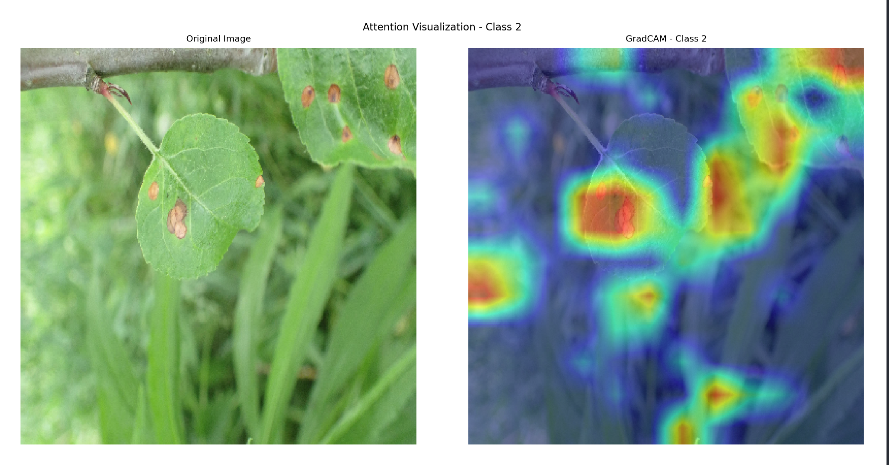
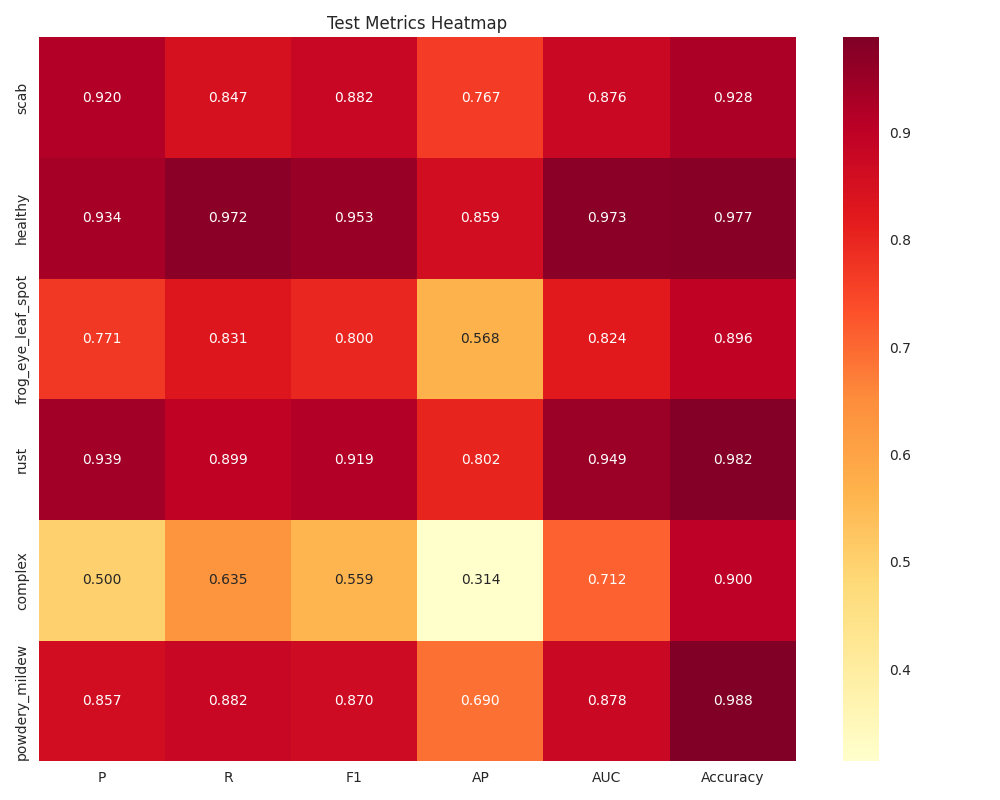

# HighLights
-  Implemented a multi-label variant of ArcFace Loss
-  Incorporated the PSA (Polarized Self-Attention) attention mechanism into the Swin Transformer architecture.

# 运行指南

SYSU 2024大三上学期计算机视觉作业
基于多神经网络与多标签ArcFaceLoss的Plant Pathology-2021解决方案与结果可视化

## 部署运行


### 安装依赖

在自己的运行目录下

```bash
git clone https://github.com/Chen1un17/ArcFace_PSA_SwinTransformer.git
conda create -n vis python=3.8
conda activate vis
pip install -r requirements.txt
```

### 路径设置

在`evaluate.py`，`train.py`中都有`data_dir`的路径设置，需要根据自己的路径重新设置绝对路径后方能正常运行

### 运行步骤

1. 训练模型
在项目根目录下运行以下命令开始训练：
如果要使用加强后的模型，需要将`check_dir`的路径改为`checkpoints_enhanced/best_model.pth`

```bash
python src/main.py --mode train

```

训练过程中，最佳模型将保存在 `checkpoints/best_model.pth`

2. 评估模型

训练完成后，使用以下命令在验证集上评估模型性能：

```bash

python src/main.py --mode evaluate

```

3. 测试模型

将`evaluate.py`中val_csv与val_images重新设置为以下

```python

    val_csv = os.path.join(data_dir, 'processed_test_labels.csv')
    val_images = os.path.join(data_dir, 'test', 'images')

```

可以使用测试集测试模型

4. 可视化模型决策

运行可视化脚本，生成 Grad-CAM 可视化结果：

对EfficientNet进行可视化

```bash

python src/visualize.py

```

对EVA-CLIP进行可视化

```bash

python src/attentionvis.py

```

对ArcPSASwinTransformer进行可视化
```bash
python src/arcvis.py
```

生成的可视化 GIF 文件将保存在 `outputs/example.gif`

效果：




